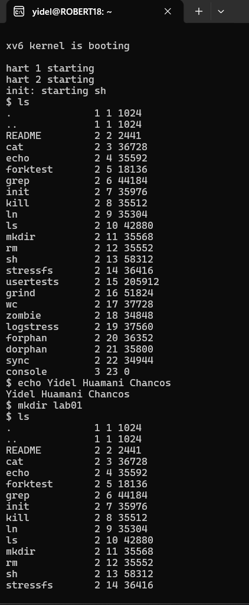
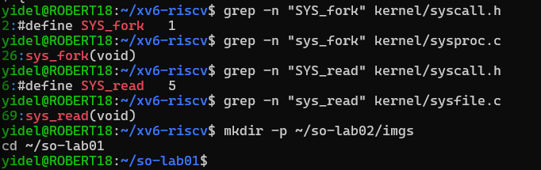

# Laboratorio 02: Instalación de xv6 sobre Ubuntu (WSL)
**Asignatura:** Sistemas Operativos (IS-380)  
**Estudiante:** Yidel  
**Docente:** Ing. Leidy Rosmery Maldonado Chauca  

---

## 1. Comandos ejecutados en xv6 (Parte A)

Dentro de la emulación de xv6 en QEMU se ejecutaron exitosamente los siguientes comandos:

1. `ls`: Para listar los archivos iniciales del sistema de archivos.
2. `echo Yidel`: Para desplegar el nombre del estudiante.
3. `mkdir lab02`: Creación de un nuevo directorio.
4. `ls`: Comprobación de que la nueva carpeta aparece en el sistema de archivos.
5. `cat README`: Lectura del archivo de texto por defecto del sistema.
6. `echo prueba de sistema de archivos > archivo.txt`: Redirección de texto hacia un archivo nuevo.
7. `cat archivo.txt`: Confirmación de la correcta escritura en el archivo.
8. `wc archivo.txt`: Conteo de líneas, palabras y caracteres.

---

## 2. Búsqueda en el Código Fuente (Parte C)

### Llamada al sistema: `fork`
- **Interfaz (`kernel/syscall.h`):**  
  `#define SYS_fork 1`
- **Implementación (`kernel/sysproc.c`):**  
  `uint64 sys_fork(void)`

### Llamada al sistema: `read`
- **Interfaz (`kernel/syscall.h`):**  
  `#define SYS_read 5`
- **Implementación (`kernel/sysfile.c`):**  
  `uint64 sys_read(void)`

---

## 3. Pregunta de Reflexión (Parte C)

**¿Qué diferencia se observa entre la interfaz de una llamada al sistema y su implementación interna?**

- **Interfaz:** Se define como una constante numérica (`#define SYS_name número`) dentro del archivo `kernel/syscall.h`. Es el identificador estandarizado que utiliza el programa en modo usuario para solicitar un servicio al sistema operativo sin conocer los detalles de su funcionamiento interno.
- **Implementación Interna:** Es la función escrita en C (`sys_fork`, `sys_read`) ubicada en módulos del kernel (`sysproc.c`, `sysfile.c`). Esta contiene la lógica real para interactuar con las estructuras de datos del núcleo y el hardware.

**Conclusión:** Esta separación permite abstracción y modularidad: el usuario solo interactúa con el número/interfaz, lo que permite al núcleo modificar o reescribir su implementación interna sin afectar el funcionamiento de las aplicaciones.
